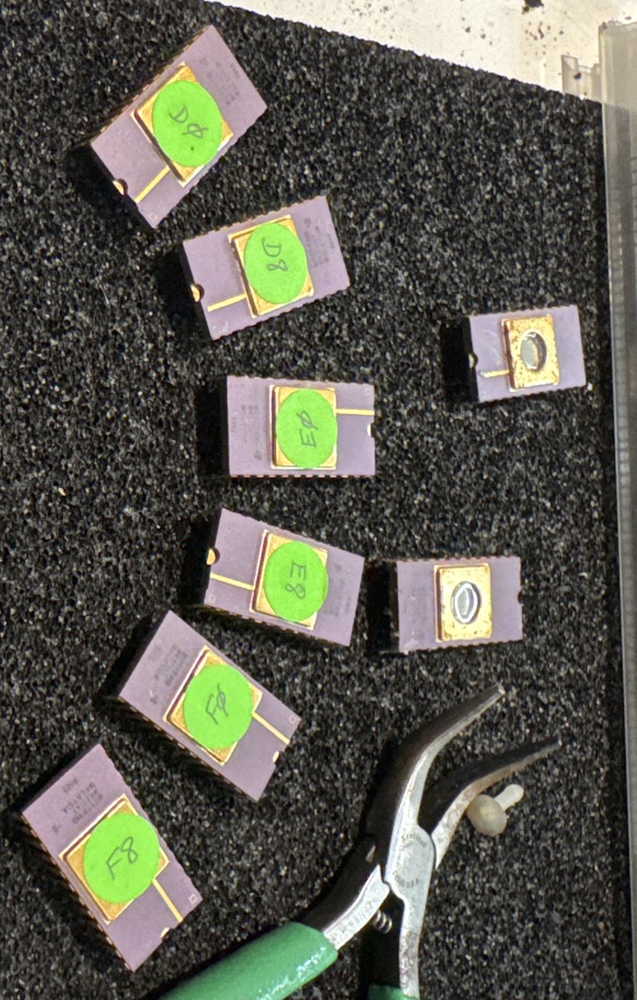

# Apple II Plus Applesoft ROM set

**6 × Mostek MK2716T-8, green stickers: D0, D8, E0, E8, F0, F8 — $D000–$FFFF, 12K**

*Complete and verified.*



---

## ⚠ Do not erase

These are **programmed** EPROMs. Keep the stickers on the quartz windows and keep
them out of UV. The contents were read on 2026-07-30/31 and are backed up, but
one chip in this set shows corrosion around the lid and none of them are getting
younger.

---

## What this is

The complete ROM set of an **Apple II Plus** — Applesoft BASIC filling
$D000–$F7FF, plus the Autostart Monitor at $F800–$FFFF. Twelve kilobytes,
continuous, six chips, no gaps.

The tube holds eight chips: these six, labelled, plus two bare-window spares that
read blank.

## Applesoft was not a later version of Integer BASIC

It replaced it, and it came from outside Apple.

Applesoft is **Microsoft's 6502 BASIC**, licensed from Microsoft and adapted by
Apple — the name is literally Apple + Microsoft. Different authors, different
codebase, no shared lineage with Wozniak's interpreter.

The reason was floating point. Woz wrote Integer BASIC in 1976 by hand and never
added floating-point math. That was fine for games and lo-res graphics and
useless for business, science or education. Rather than wait, Apple licensed
Microsoft's BASIC, added the hi-res graphics commands (`HGR`, `HPLOT`, `DRAW`,
`XDRAW`), and shipped it in ROM on the II Plus in 1979.

The swap cost something. Applesoft is measurably slower than Integer BASIC at
integer work, which is why arcade-style games kept targeting Integer machines for
years afterward. And **SWEET16 and the Mini-Assembler went away** — those were
Woz's, they lived in the Integer ROM, and they never came back. They are on the
[Integer set page](../apple2-integer/), not here.

There is a fingerprint of the two lineages visible in the bytes. Applesoft stores
its strings as plain ASCII with **bit 7 set on the last character**. Integer BASIC
sets bit 7 on **every** character and clears it on the last. Two inverted
conventions occupying the same address space on the same machine — Microsoft's
habit and Woz's habit, side by side.

## Structure

```
$D000–$D7FF   Applesoft: tokens, error table, statement dispatch   ← chip D0
$D800–$DFFF   Applesoft: statement execution                       ← chip D8
$E000–$E7FF   Applesoft: cold/warm start, evaluation               ← chip E0
$E800–$EFFF   Applesoft: floating point (FADD, FSUB, FMULT…)       ← chip E8
$F000–$F7FF   Applesoft: transcendentals, hi-res graphics          ← chip F0
$F800–$FFFF   Autostart Monitor                                     ← chip F8
```

The error message table sits at `$D260` and is the single most decisive
identification signature — Integer BASIC's is completely different:

```
$D260  NEXT WITHOUT FOR        $D2E5  DIVISION BY ZERO
$D270  SYNTAX                  $D2F5  ILLEGAL DIRECT
$D276  RETURN WITHOUT GOSUB    $D303  TYPE MISMATCH
$D28A  OUT OF DATA             $D310  STRING TOO LONG
$D295  ILLEGAL QUANTITY        $D31F  FORMULA TOO COMPLEX
$D2A5  OVERFLOW                $D332  CAN'T CONTINUE
$D2AD  OUT OF MEMORY           $D340  UNDEF'D FUNCTION
$D2BA  UNDEF'D STATEMENT       $D350   ERROR
$D2CB  BAD SUBSCRIPT           $D358   IN
$D2D8  REDIM'D ARRAY           $D35E  BREAK
```

[Full error table →](files/applesoft-error-table.md)

## Provenance

| Sticker | Part | Date code | Condition | File | sha256 (first 16) |
|---|---|---|---|---|---|
| D0 | MK2716T-8 | 8003 | ✅ clean, 5/5 | [applesoft_D0.bin](files/applesoft_D0.bin) | `b45168834f01e11a` |
| D8 | MK2716T-8 | 8003 | ✅ clean, 5/5 | [applesoft_D8.bin](files/applesoft_D8.bin) | `468d36201974ecbe` |
| E0 | MK2716T-8 | 8003 | ✅ 2 unstable, both adjudicated | [applesoft_E0.bin](files/applesoft_E0.bin) | `2814de134e79213e` |
| E8 | MK2716T-8 | 8003 | ✅ clean, 5/5 | [applesoft_E8.bin](files/applesoft_E8.bin) | `6848707531d7a893` |
| F0 | MK2716T-8 | 8003 | 5 unstable bytes | [applesoft_F0.bin](files/applesoft_F0.bin) | `c3a627b5099e1e20` |
| F8 | MK2716T-8 | 8003 | ✅ clean; **identical to the Integer set's F8** | [applesoft_F8.bin](files/applesoft_F8.bin) | `29465303e7844fa5` |

Mostek MK2716T-8, purple ceramic with gold lid, made in Malaysia, date code 8003
(1980, week 3). Read with `minipro`, profile `M2716@DIP24`, five passes each.

## How this image was verified

Four independent checks, none of which relies on an outside reference:

**The error table is intact and in the documented order** — twenty messages from
`$D260` to `$D35E`, no corruption anywhere in the table.

**An instruction is physically split across the D0/D8 chip boundary:**

```
D7FF  85 B8    STA $B8      ← the 85 is the last byte of D0; the B8 is the first byte of D8
D801  90 02    BCC $D805
```

You cannot get that by accident. The chips are adjacent, correctly ordered, and
the stickers are right.

**Every seam is continuous.** `$F000` reads `JSR $EA5E / JSR $EB63 | JSR $EC23` —
three consecutive calls straddling the boundary. The D8 chip's final `JMP $E007`
lands inside a jump table that opens the E0 chip.

**F8 is byte-identical to the AMD F8** from the other set. Different manufacturer,
different machine, different forty-year storage history, same 2048 bytes.

### The two unstable bytes, resolved

Both drop **bit 7**, and both alternated deterministically across passes
(`DD 5D DD 5D DD`). The disassembler settles `$E325` outright:

```
$E325 = DD  →  JSR $DD6A   target in ROM       ✓
$E325 = 5D  →  JSR $5D6A   target in RAM       ✗ impossible for a ROM call
```

Majority vote picked `DD`. Held-zero reconstruction would have picked `5D` and
produced a ROM that jumps into empty RAM — see [the method page](../method/) for
why that matters more generally.

The first read session left 7 unstable bytes; sessions two and three came back
**byte-identical to each other**, which is the convergence signal worth trusting.

## Files

- [**applesoft_D000-FFFF.bin**](files/applesoft_D000-FFFF.bin) — the complete 12K
  image. sha256 `8cd6be119991b09f8922d248d89b17d5b42557f42ab4f25c12c49711072691d6`
- Individual 2K blocks: [D0](files/applesoft_D0.bin) · [D8](files/applesoft_D8.bin) · [E0](files/applesoft_E0.bin) · [E8](files/applesoft_E8.bin) · [F0](files/applesoft_F0.bin) · [F8](files/applesoft_F8.bin)
- [**applesoft_D000-FFFF.asm**](files/applesoft_D000-FFFF.asm) — 6,500-line
  annotated disassembly, unstable bytes flagged
- [applesoft-error-table.md](files/applesoft-error-table.md)

Reassemble from the individual blocks in address order:

```bash
cat applesoft_D0.bin applesoft_D8.bin applesoft_E0.bin \
    applesoft_E8.bin applesoft_F0.bin applesoft_F8.bin > applesoft_D000-FFFF.bin
```

---

*[← All recovered EPROMs](../) · [How these were read](../method/) · [The Integer BASIC set](../apple2-integer/)*

*ROM code © Apple Computer and Microsoft. Published here as recovered firmware
with documented provenance; the images are already widely archived. Disassembly
annotations, provenance records and tooling are original work.*
