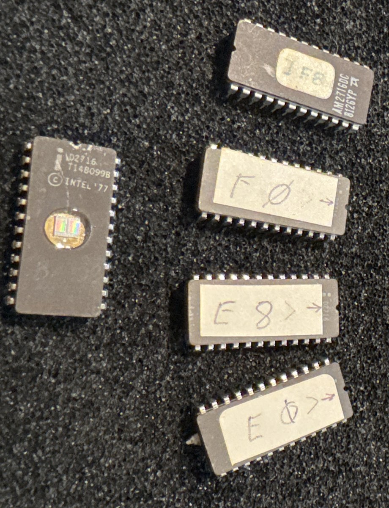
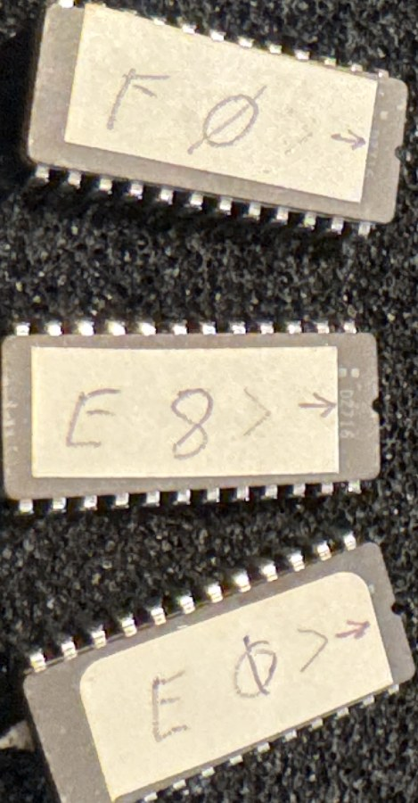

# Apple II Integer BASIC ROM set

**3 × Intel D2716 + 1 × AMD AM2716DC — labelled E0, E8, F0, F8 — $E000–$FFFF, 8K**



---

## ⚠ Do not erase

These are **programmed** EPROMs. Keep the stickers on the quartz windows and keep
them out of UV. The contents below were read on 2026-07-30 and are backed up, but
one chip in this set is already dead and the rest are forty-five years old.

---

## What this is

The complete ROM complement of an **original 1977 Apple II** — the machine Woz
designed — that somebody later upgraded with the Autostart Monitor.

The original Apple II motherboard had six ROM sockets (D0, D8, E0, E8, F0, F8)
and shipped with only four filled: Integer BASIC in E0/E8/F0, and Woz's Monitor
in F8. D0 was left open for the optional Programmer's Aid, and D8 stayed empty.
So four chips is not a partial set. It is the whole machine.

But the F8 here is not the 1977 monitor. The original resets to `$FF59`; this one
resets to **`$FA62`**, prints `"APPLE ]["` from `$FB09`, and carries the vectors
`$03FB / $FA62 / $FA40`. That is the **Autostart Monitor**, introduced on the
Apple II Plus in 1979 and sold separately as a single-chip upgrade for existing
Apple IIs. It added auto-boot from a disk controller, arrow-key line editing, and
a Ctrl-Reset that returned to BASIC instead of dumping you into the monitor.

## The chips themselves tell the upgrade story

This set is **not four chips from one batch**. It is three of one thing and one of
another, and the split falls exactly on the software boundary:

| | E0, E8, F0 — Integer BASIC | F8 — Autostart Monitor |
|---|---|---|
| Part | Intel **D2716** | AMD **AM2716DC** |
| Marking | `T148099B`, © **INTEL '77** | date code **8126** (1981, week 26) |
| Label | white paper, pencil, slashed zeros, orientation arrow | separate sticker, different hand |

Three Intel parts carrying © 1977 hold the BASIC. A single AMD part from 1981 —
the newest chip in the set, from a different manufacturer, labelled in a different
style — holds the Monitor.

That is precisely what a later-fitted Autostart upgrade looks like: the original
Integer BASIC chips left alone, one socket reburned four years on. The physical
evidence and the code both say the same thing, independently.



## Why this set is the interesting one

Integer BASIC is Wozniak's own work, written in 1976 with no assembler — he wrote
the machine code out by hand on paper. It has no floating point. It is fast, it
drives the lo-res graphics (`PLOT`, `HLIN`, `VLIN`, `COLOR`), and games targeted
it for years after Applesoft arrived because it ran integer loops noticeably
quicker.

Two things live in this ROM that **do not exist on an Apple II Plus** — when
Apple switched to Applesoft, they were dropped and never came back:

**SWEET16**, at `$F689`. A 16-bit virtual machine implemented in about 300 bytes
of 6502, written because 16-bit pointer arithmetic on a 6502 is painful and Woz
wanted denser code. It is one of the most admired pieces of code in
microcomputer history.

```
F689  20 4A FF   JSR $FF4A      ; save the 6502 registers
F68C  68         PLA            ; the return address becomes SWEET16's PC
F68D  85 1E      STA $1E
F692  20 98 F6   JSR $F698      ; interpreter loop
F695  4C 92 F6   JMP $F692
```

Its only calls outside itself are `SAVE` ($FF4A) and `RESTORE` ($FF3F) — about
thirty bytes of register shuffling between them. Reimplement those two stubs and
SWEET16 runs on any 6502 you like.

**The Mini-Assembler**, entered at `$F666` (`F666G` from the monitor prompt).
Hand-assemble 6502 by mnemonic, on a machine with no disk and 4K of RAM.

```
F666  4C 92 F5   JMP $F592
```

## Structure

```
$E000–$E7FF   Integer BASIC, part 1     ← chip E0  (NOT RECOVERED — chip dead)
$E800–$EFFF   Integer BASIC, part 2     ← chip E8
$F000–$F7FF   Integer BASIC, part 3     ← chip F0  (SWEET16, Mini-Assembler)
$F800–$FFFF   Autostart Monitor         ← chip F8
```

The Monitor is the machine's BIOS, firmware and debugger in 2K: character I/O,
cassette read/write, lo-res graphics primitives, memory examine/deposit/move/
verify, and a disassembler — what you reached with `CALL -151`.

Its I/O is **vectored through zero page**, which is why this ROM ports to homebrew
hardware so readily:

```
COUT:   FDED  6C 36 00   JMP ($0036)     ; output hook — CSWL/CSWH
RDKEY:  FD18  6C 38 00   JMP ($0038)     ; input hook  — KSWL/KSWH
```

Point those at your own serial routines and Integer BASIC talks to a terminal
with no Apple video hardware at all.

## Provenance

Every file below came off these physical chips. Nothing here is borrowed from an
archive.

| Label | Part | Marking | Condition | File | sha256 (first 16) |
|---|---|---|---|---|---|
| E ∅ → | Intel D2716 | T148099B, © INTEL '77 | **not recovered** — see below | — | — |
| E 8 → | Intel D2716 | T148099B, © INTEL '77 | ⚠ 73 unstable bytes, all D3 | [integer_E8.bin](files/integer_E8.bin) | `6ec353d0d370a672` |
| F ∅ → | Intel D2716 | T148099B, © INTEL '77 | 6 unstable bytes, all D3 | [integer_F0.bin](files/integer_F0.bin) | `2dea6ceaea1079a5` |
| F8 | AMD AM2716DC | 8126YP | ✅ clean, 5/5 passes | [integer_F8.bin](files/integer_F8.bin) | `29465303e7844fa5` |

A fourth Intel D2716 sits with the set with its window uncovered and reads blank —
a spare from the same batch.

Read with `minipro`, five passes each, per-bit majority, profile `AM2716@DIP24`.
`minipro` has no Intel-specific 2716 entry; the generic `M2716@DIP24` was tested
against the E0 chip and produced identical results.

### The E0 chip does not read

It returns only **11 distinct byte values** across 2048 bytes, with six of eight
data bits (D0, D1, D3, D4, D5, D6) pinned near zero on every pass, and no 6502
opcode structure whatsoever. Since an empty socket on this programmer floats to
`$FF`, those pins are connected and being actively driven low — which points at
the die rather than at a contact problem. Contact cleaner made it marginally
worse, twice.

The obvious alternative explanation — an Intel part read under the wrong device
profile — has been **tested and ruled out**. `minipro` carries no Intel-specific
2716 entry, so the chip was read under `AM2716@DIP24` twice and `M2716@DIP24`
once, the latter being the profile that read all six Mostek chips cleanly on the
same rig. All three attempts produced the identical signature: ~10 distinct byte
values, every one drawn from `00 / 04 / 80 / 84`, only D7 and D2 carrying
anything. Changing the profile changed nothing, which is what you would expect if
the profile was never the variable.

`$E000–$E7FF` is therefore missing, and will stay missing. It is well archived
elsewhere; this page does not reproduce it, because everything published here is
meant to be what came off these particular chips.

### The E8 block carries known errors

Do not treat `integer_E8.bin` as clean. All 73 of its unstable bytes are in data
bit 3, dropping from 1 to 0, and the damage is legible in the Integer BASIC error
message table:

| as read | should be |
|---|---|
| `TGO LGNG` | `TOO LONG` |
| `SYNTAP` | `SYNTAX` |
| `STRANG` | `STRING` |
| `FO EFD` | `NO END` |
| `BAD BRAFC@` | `BAD BRANCH` |
| `RETYPE LIFE` | `RETYPE LINE` |
| `DAM` | `DIM` |

Every single error is bit 3, in one direction. The chip's pins have not yet been
cleaned — the same treatment recovered a Mostek chip from total failure, so this
block is expected to improve.

## Files

- [**integer_E800-FFFF.bin**](files/integer_E800-FFFF.bin) — 6K, the three
  recovered blocks concatenated. sha256 `7ca1f4ca7e8ccb5618370c9957ce92db…`
  Note this is *not* a runnable ROM: `$E000–$E7FF` is absent and the `$E800`
  block has known bit-3 errors.
- [integer_E8.bin](files/integer_E8.bin) · [integer_F0.bin](files/integer_F0.bin) · [integer_F8.bin](files/integer_F8.bin) — individual 2K blocks
- [**integer_E800-FFFF.asm**](files/integer_E800-FFFF.asm) — annotated disassembly
- [**F8_autostart_monitor.asm**](files/F8_autostart_monitor.asm) — the Monitor alone, $F800–$FFFF

Disassemblies are annotated with soft switches, monitor entry points and monitor
zero page, and every line containing an unstably-read byte is flagged.

## Reading the text

Apple II stores characters with **bit 7 set** — `A` is `$C1`, not `$41` — so a hex
editor's ASCII column shows nothing but dots. Integer BASIC additionally *clears*
bit 7 on the **last** character of each message as an end marker.

```bash
python3 -c "import sys;d=open(sys.argv[1],'rb').read();\
s=''.join(chr(b&0x7f) if 32<=(b&0x7f)<127 else chr(10) for b in d);\
print(chr(10).join(l for l in s.split(chr(10)) if len(l)>4))" integer_E8.bin
```

Applesoft, incidentally, does the exact opposite — plain ASCII with bit 7 set on
the last character only. Two inverted conventions in the same address space, and
independent evidence that these are unrelated codebases rather than successive
versions of one.

## If you want to run this on real hardware

A caution that catches people: **you cannot drop a 27C32 into a 2716 socket.**
Pin 21 is Vpp on a 2716 and A11 on a 2732/27C32. The Apple II's sockets expect
9316B mask ROMs, which differ again on the control pins.

---

*[← All recovered EPROMs](../) · [How these were read](../method/)*

*ROM code © Apple Computer. Published here as recovered firmware with documented
provenance; the images are already widely archived. Disassembly annotations,
provenance records and tooling are original work.*
