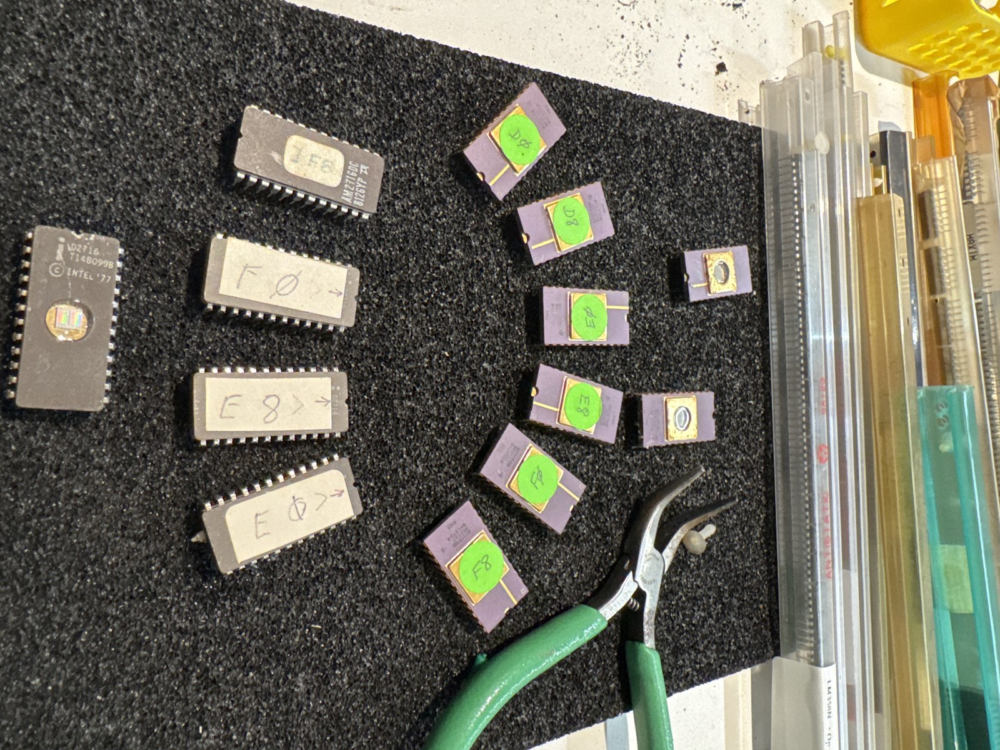

# Recovered EPROMs

Firmware read off surplus EPROMs found in a lot of 1970s–80s integrated circuits,
preserved before the chips degrade any further.

Every image here was read on an XGecu TL866II Plus, five passes per chip,
reconciled byte by byte. Checksums, per-chip provenance and full disassemblies
are on each set's page.



---

## ⚠ If you are holding a tube of these chips

**Do not put them under a UV lamp. Do not remove the stickers from the windows.**

These are programmed EPROMs. The paper and vinyl labels covering the quartz
windows are what has kept ambient light from erasing them for forty years.

The contents have been read and are backed up — but the physical chips are still
the artifact, and once erased they cannot be recovered.

---

## The two Apple II ROM sets

Sorting the lot turned up two complete Apple II ROM sets on 2716 EPROMs, from two
different machines, evidently from the same workbench. They are copies: Apple
shipped these as mask ROMs, so somebody read a machine's ROMs onto blank EPROMs
and hand-labelled each one with its socket address.

| Set | Chips | Maps to | Contents |
|---|---|---|---|
| [**Integer BASIC**](apple2-integer/) | 3 × Intel D2716 + 1 × AMD AM2716DC | $E000–$FFFF, 8K | Woz's Integer BASIC + Autostart Monitor — an original 1977 Apple II with the Autostart upgrade |
| [**Applesoft**](apple2-applesoft/) | 6 × Mostek MK2716T-8, green stickers | $D000–$FFFF, 12K | Microsoft's Applesoft BASIC + Autostart Monitor — an Apple II Plus |

Both sets carry the **same** Autostart Monitor at $F800–$FFFF, and the two chips
are byte-identical:

```
sha256  29465303e7844fa56a8c846d0565e45f5ee082f98f2ccf1b261de4a7e902201b
```

Two manufacturers, two sets, two independent storage histories, the same 2048
bytes. That match is the strongest verification available here and it is what
gives the rest of the work its confidence.

## Status

| | Applesoft (Mostek) | Integer (Intel + AMD) |
|---|---|---|
| Blocks recovered | **6 of 6** — $D000–$FFFF complete | 3 of 4 — $E800–$FFFF |
| Verified | ✅ checksums, seams, disassembly, error table | ⚠ one block carries known read errors |
| Missing | — | $E000–$E7FF (chip electrically dead) |
| Booted in an emulator | not yet | not yet |

## Method

[**How these were read →**](method/)

The reusable part of this project: multi-pass voting, why agreement between reads
is not the same as correctness, why the obvious rule for reconstructing decayed
cells is wrong about half the time, and the scripts that do it.

---

## Not yet read

The rest of the programmed EPROMs in the lot. Unlike the Apple ROMs — which are
exhaustively archived and preserved here mainly as verified provenance — some of
these may not exist anywhere else.

| Chips | Labels | Why it matters |
|---|---|---|
| Seeq 2764 × 5+ | `IBM BIOS F800`, `COMPATIBLE BIOS`, `AST 1140 / D-0159`, `RIMOS` | IBM's own BIOS is well preserved; a specific clone BIOS and an AST card's firmware may not be |
| 28-pin, 1 | `TURBO-PLUS(R) COPY WRITE 1986, SERIAL NO. GST 83458` | Serial-numbered commercial accelerator firmware |

The three Intel D2716s previously listed here as "contents unknown, labels
illegible" turned out to be the Integer BASIC set above, once photographed at an
angle that made the pencil legible.

---

*Part of [Constellation Pages](../). Read and documented 2026-07.*
