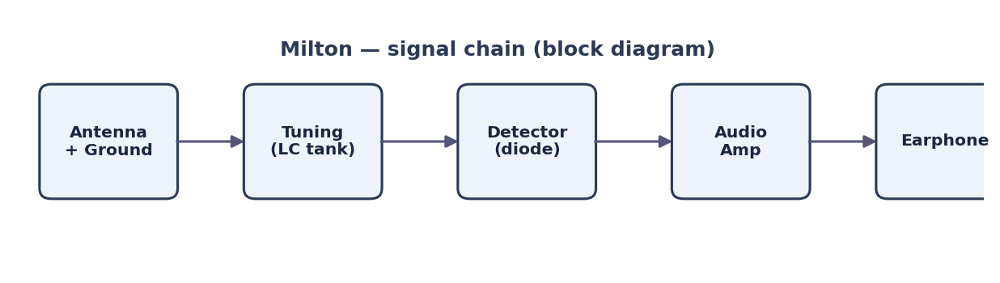

# Milton the Radio — build diary

A running log of the Milton radio build: design decisions, wiring, parts, and
schematics.

## Overview

*(One or two lines on what Milton is and what you're going for — the kind of
radio, the goal, the vibe.)*

## Schematics

Diagrams live in [`schematics/`](schematics/). Embed one with a relative path so
it travels with the page:

*Above: a placeholder block diagram, here just to show how an image renders.
Replace it with the real schematic when it's drawn.*

## Build log

### Entry 1 — *date*

*(What you did, what worked, what didn't. Add a new dated entry per session.)*

## Parts

*(Running list of components — value, source, notes.)*

## References

External links render as normal markdown links and open in the browser:

- [ARRL Technical Information Service — reference (PDF)](https://www.arrl.org/files/file/Technology/tis/info/pdf/0003037.pdf)
