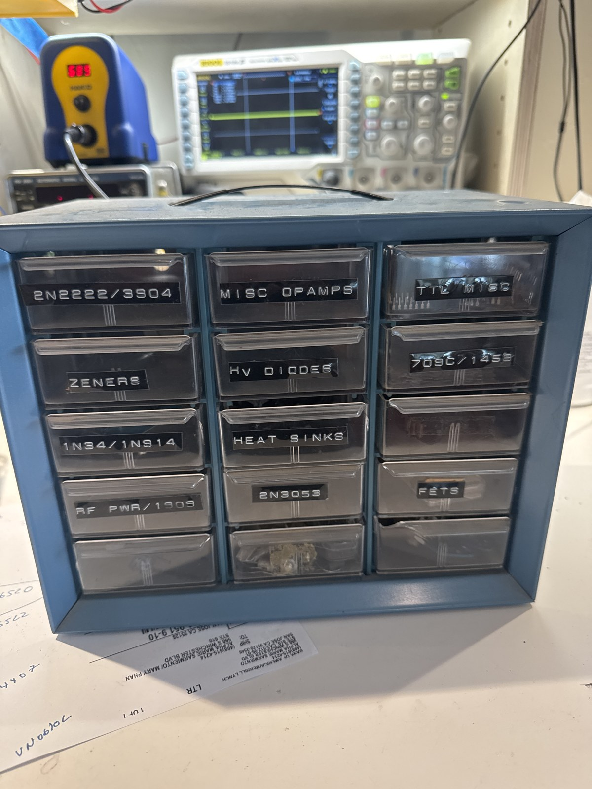

# Dad's Parts Stash

*Dad's parts cabinet -- 15 drawers, his own labels (MISC OPAMPS, 709C/1458, TTL MISC, HV DIODES, ZENERS, 1N34/1N914, RF PWR/1909, 2N3053, FETS, HEAT SINKS, 2N2222/3904, + blanks). Kept intact as one collection.*

*A special surplus stash inherited from Bill's father -- the source of parts for many past builds. Deliberately kept INTACT as one collection rather than distributed into the other bins, even where it duplicates categories stocked elsewhere. Logged in place; each part carries its normal functional Bin but this one Storage Location so the whole stash stays together and findable.*

**Where:** Dad's parts stash (kept as-is, its own container).  
**Contents:** 82 pcs (rough) · 22 part numbers.

> Generated from `engineering/component-inventory.csv` — **do not edit by hand.** Edit the CSV and rerun `engineering/gen-bin-pages.py`. Last generated 2026-08-01.

## Logic -- CMOS / TTL

- [ ] **N74H73A** — dual J-K flip-flop with clear, high-speed 74H bipolar TTL family — ×1 · *Signetics*
- [ ] **Assorted 74-series TTL** — Bulk lot of ~35-40 assorted small-scale 74-series TTL logic ICs, mostly 14-pin DIP (a few 16-pin), 1970s — ×~38 (approx) · *mixed lot*

## Op-amps

- [ ] **RCA CA3030** — RCA (later Harris) operational amplifier, 12V wideband type, 14-pin DIP — ×2

## Analog / power / other

- [ ] **2240CP** — XR-2240-type programmable timer/counter (timebase oscillator + 8-bit programmable binary counter) — ×1
- [ ] **Clairex Photomod** — a photoconductive optocoupler / photomodule: an incandescent lamp optically coupled to a CdS photocell in one sealed package — ×1 · *lamp + cell*

## Unidentified

- [ ] **7741393 / U6E6927** — Unidentified 14-pin gold-lead ceramic DIP — ×1 · *circle monogram logo*
- [ ] **DEC7384** — Texas Instruments-made, DEC house-numbered IC (DEC7384) — ×2 · *TI-made; DEC house number*
- [ ] **653-1 / 76951** — Signetics house-numbered IC (custom part number '653-1'; '76951' likely a drawing/lot number) — ×3 · *Signetics logo*
- [ ] **359-03 / 9004** — Signetics house-numbered IC (custom number '359-03'; '9004' may be a Signetics 9000-series digital family code) — ×1 · *Signetics logo, date 7523*

## Diodes

- [ ] **1N34 / 1N914** — Signal diodes, as labeled: 1N914 silicon switching diodes (a vial full, dozens, DO-35 red-banded glass) plus 1N34 germanium point-contact diodes — ×many (vial of 1N914 + 1N34s); not counted · *drawer as labeled*
- [ ] **ZENER 1N758** — Zener diodes: a vial labeled 1N758 (10V, ~0.5W zener) plus a few loose axial zeners in the drawer — ×vial of 1N758 + a few loose; not counted · *drawer as labeled*
- [ ] **Assorted HV & power rectifiers** — Jumble of high-voltage and power rectifier diodes (this is where the cabinet's HV diodes actually live; the labeled HV DIODES drawer is empty) — ×assorted (a drawerful)

## Transistors -- RF / high-fT

- [ ] **2N3553** — NPN silicon RF power transistor (VHF ~175 MHz, ~7W), TO-39 — ×2  `NPN`

## Transistors -- small-signal (general)

- [ ] **Assorted random transistors** — Catch-all drawer of random loose TO-92 transistors from Dad's bin — ×~3 (growing) · *TO-92*  `mixed`

## Transistors -- power

- [ ] **2N3053** — NPN medium-power driver, TO-39 metal can (40V, 0.7A, 5W) — ×15 · *TI + others*  `NPN`
- [ ] **RCA 2N5321** — RCA NPN power transistor, TO-39 (~75V, 2A, audio/general power) — ×1  `NPN`
- [ ] **2N4036** — PNP medium-power transistor, TO-39 (~90V, 1A) — ×1  `PNP`

## Transistors -- FETs

- [ ] **MPF102** — N-channel JFET, VHF/RF amplifier, mixer, and switch — ×1  `N-ch (JFET)`
- [ ] **DF60214Q** — Metal-can FETs marked 'DF60214Q' — ×~3 · *metal can*

## Other

- [ ] **IC & transistor sockets + DIP pin straightener** — Unlabeled drawer of build hardware: assorted DIP IC sockets (8/14-pin, including machined-pin), round transistor sockets (TO-5/TO-18), some larger black sockets, and a pink DIP pin-straightener tool — ×assorted (a drawerful)
- [ ] **Heat sinks + thermal compound** — HEAT SINKS drawer (as labeled): assorted clip-on star/finned TO-5/TO-18 heat sinks, a TO-220 heatsink with a power device still mounted, and a tube of Radio Shack heat-sink compound (silicone/zinc-oxide thermal grease) — ×assorted (a drawerful)
- [ ] **1/4-inch jacks + misc** — 1/4-inch (6.35 mm) phone jacks and assorted misc hardware — ×assorted

---
*Full detail (date codes, notes, confidence) in the master `component-inventory.csv`. This page is the QR target for the bin.*
